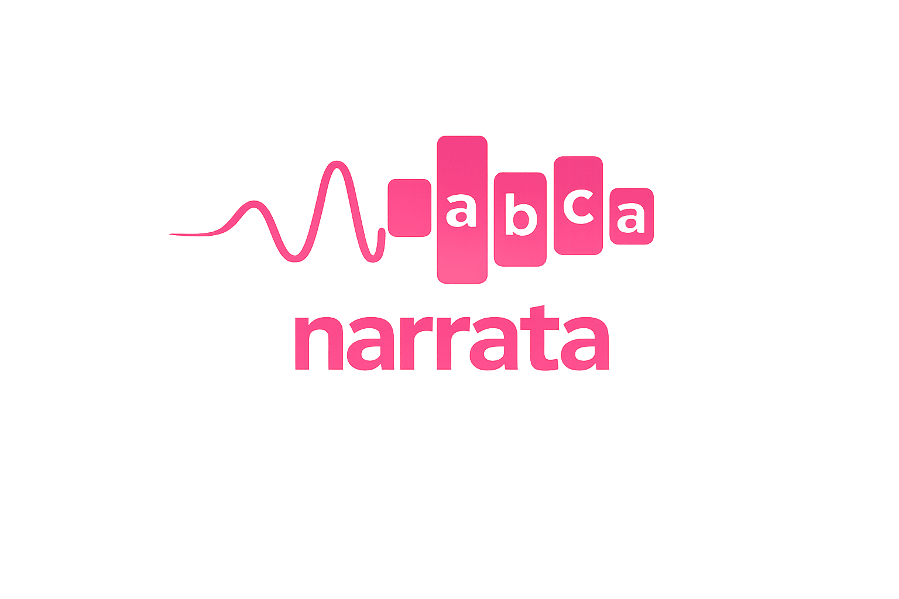

<p align="center">
  
</p>

<p align="center">
  <a href="https://github.com/marcinmiklitz/narrata/actions/workflows/tests.yml">
    
  </a>
  
</p>

# narrata

`narrata` turns price series into short text that an LLM can reason about quickly.

It is designed for situations where a chart is easy for a human to read, but you need an agent to consume the same information as text.

## Installation

From PyPI:

```bash
pip install narrata
```

With optional extras for enhanced backends:

```bash
pip install "narrata[all]"
```

Requires Python 3.11+ and pandas 2.0+.

## Quickstart

Default usage is just `narrate(df)` on a standard OHLCV DataFrame:

```python
import numpy as np
import pandas as pd

from narrata import narrate

n = 120
dates = pd.date_range("2025-01-01", periods=n, freq="D")
rng = np.random.default_rng(7)
close = np.linspace(140.0, 175.0, n) + rng.normal(0.0, 1.0, n)
open_ = close + rng.normal(0.0, 0.6, n)
high = np.maximum(open_, close) + np.abs(rng.normal(0.7, 0.2, n))
low = np.minimum(open_, close) - np.abs(rng.normal(0.7, 0.2, n))
volume = rng.integers(900_000, 2_100_000, n)

df = pd.DataFrame(
    {"Open": open_, "High": high, "Low": low, "Close": close, "Volume": volume},
    index=dates,
)
df.attrs["ticker"] = "AAPL"

print(narrate(df))
```

Example output:

```text
AAPL (120 pts, daily): ▁▁▂▂▂▃▃▄▄▄▄▅▆▆▆▆▇▇██
Date range: 2025-01-01 to 2025-04-30
Range: [$139.99, $175.68]  Mean: $157.35  Std: $10.33
Start: $140.00  End: $175.19  Change: +25.14%
Regime: Uptrend since 2025-01-02 (low volatility)
RSI(14): 65.1 (neutral-bullish)  MACD: bullish crossover 1 day ago
BB: near upper band
Volume: 0.98x 20-day avg (average)
Volatility: 23rd percentile (low)
SAX(16): aaabbccdeeffgggh
Patterns: Ascending triangle forming since 2025-03-02
Candlestick: Doji on 2025-04-29
Support: $145.13 (13 touches), $139.99 (6 touches)  Resistance: $175.68 (3 touches)
```

For reproducible generated examples:

```bash
python scripts/generate_backend_examples.py
make update-examples
```

See the [fallback/extras comparison](#fallback-vs-extras-same-input) below for full 252-point output.

## Fallback vs extras (same input)

<!-- BACKEND_COMPARISON:START -->
Using the same deterministic 252-point dataset:

Use separate clean virtual environments when comparing fallback vs extras.

Fallback-only (`pip install narrata`):

```text
AAPL (252 pts, business-daily): ▁▂▁▂▂▃▃▃▄▄▄▅▆▆▆▆▇▇▇█
Date range: 2024-01-02 to 2024-12-18
Range: [$140.61, $201.32]  Mean: $170.44  Std: $17.52
Start: $141.05  End: $201.32  Change: +42.73%
Regime: Uptrend since 2024-12-10 (low volatility)
RSI(14): 72.9 (overbought)  MACD: bullish crossover 7 days ago
BB: above upper band
SMA 50/200: golden cross
Volume: 0.95x 20-day avg (average)
Volatility: 1st percentile (extremely low)
SAX(16): aaabbcdeefggghhh
Patterns: Ascending triangle forming since 2024-09-26
Candlestick: Bullish Engulfing on 2024-12-17
Support: $193.16 (27 touches), $156.63 (26 touches)  Resistance: $201.32 (4 touches)
```

With extras (`pip install "narrata[all]"`):

```text
AAPL (252 pts, business-daily): ▁▂▁▂▂▃▃▃▄▄▄▅▆▆▆▆▇▇▇█
Date range: 2024-01-02 to 2024-12-18
Range: [$140.61, $201.32]  Mean: $170.44  Std: $17.52
Start: $141.05  End: $201.32  Change: +42.73%
Regime: Uptrend since 2024-10-02 (low volatility)
RSI(14): 72.9 (overbought)  MACD: bullish crossover 7 days ago
BB: above upper band
SMA 50/200: golden cross
Volume: 0.95x 20-day avg (average)
Volatility: 1st percentile (extremely low)
SAX(16): aaabbbcddefggghh
Patterns: Ascending triangle forming since 2024-09-26
Candlestick: Doji on 2024-12-11
Support: $193.16 (27 touches), $156.63 (26 touches)  Resistance: $201.32 (4 touches)
```

Main differences in this run:
- `Regime` changed: `Regime: Uptrend since 2024-12-10 (low volatility)` -> `Regime: Uptrend since 2024-10-02 (low volatility)`
- `SAX(16)` changed: `SAX(16): aaabbcdeefggghhh` -> `SAX(16): aaabbbcddefggghh`
- `Candlestick` changed: `Candlestick: Bullish Engulfing on 2024-12-17` -> `Candlestick: Doji on 2024-12-11`
<!-- BACKEND_COMPARISON:END -->

## Compose your own output

Use lower-level functions when you want full control:

```python
from narrata import analyze_summary, describe_summary, make_sparkline

summary = analyze_summary(df)
text_block = describe_summary(summary)
spark = make_sparkline(df["Close"].tolist(), width=12)

print(text_block)
print(f"Close sparkline: {spark}")
```

## Public imports

All supported public methods are re-exported from top-level `narrata`.

```python
from narrata import narrate, analyze_summary, analyze_regime, analyze_indicators
from narrata import sax_encode, astride_encode, detect_patterns, find_support_resistance
from narrata import make_sparkline, digit_tokenize, to_plain, to_markdown_kv, to_toon
```

You can also import from module paths (for example `narrata.analysis.indicators`) when preferred.

For the complete current top-level export list:

```python
import narrata
print(narrata.__all__)
```

## Output formats

You can keep the output plain, render as Markdown key-value, or serialize to TOON.

```python
from narrata import narrate

markdown_text = narrate(df, output_format="markdown_kv")
plain_text = narrate(df, output_format="plain")
```

## Token-level compression

When you need digit-level spacing:

```python
from narrata import digit_tokenize

print(digit_tokenize("Price 171.24, move +3.2%"))
# <digits-split>
# Price 1 7 1 . 2 4 , move + 3 . 2 %
```

## Dependencies

Core dependencies include `pandas`, `numpy`, and `toons`.

Optional extras:

- `indicators`: `pandas-ta-openbb` (import path remains `pandas_ta`)
- `patterns`: `pandas-ta-openbb` (candlestick pattern backend)
- `regimes`: `ruptures` (for change-point regime detection)
- `symbolic`: `tslearn`, `ruptures` (`ruptures` currently supports Python < 3.14)
- `all`: install all compatible extras for your interpreter

Local setup:

```bash
make sync
```

`make sync` installs both workspace projects (`src/narrata` and `src/narrata-mcp`).

Build both distributable packages locally:

```bash
make build-all
```

## Agent Integrations

### narrata Skill

A reusable skill is included at `skills/narrata/SKILL.md`.

Depending on your CLI:

- Anthropic-style skills dir: copy to `~/.agents/skills/narrata/`
- Codex-style skills dir: copy to `~/.codex/skills/narrata/`

```bash
mkdir -p ~/.agents/skills/narrata
cp skills/narrata/SKILL.md ~/.agents/skills/narrata/SKILL.md
```

### FastMCP Server

A dedicated MCP package is included at `src/narrata-mcp`.

Install and run:

```bash
pip install narrata-mcp
narrata-mcp
```

Tool docs and setup details are in `src/narrata-mcp/README.md`.

## What is implemented today

- Input validation for OHLCV DataFrames
- Summary analysis with date range context
- Regime classification (`Uptrend` / `Downtrend` / `Ranging`)
- RSI and MACD interpretation (uses `pandas_ta` indicator lines when available)
- Volume analysis (ratio to moving average)
- Bollinger Band position and squeeze detection
- Moving average crossover detection (golden/death cross)
- Volatility percentile ranking
- SAX symbolic encoding
- ASTRIDE adaptive symbolic encoding (requires `ruptures`)
- Pattern detection plus candlestick detection (`pandas_ta` first, in-house fallback)
- Support/resistance extraction
- Compact Unicode sparklines
- Output formatting helpers (`plain`, `markdown_kv`, `toon`)
- High-level `narrate(...)` composition

## FAQ

### Is narrata redundant if I already use OpenBB, yfinance, or another data SDK?

No. `narrata` is complementary.

It sits on top of your existing data layer and turns OHLCV data into compact, LLM-ready narrative text.

Typical flow:

```text
Data source (OpenBB / yfinance / CSV / DB)
        -> pandas DataFrame (OHLCV)
        -> narrata
        -> concise narrative context for an LLM
```

`narrata` is data-source-agnostic: if you can produce a standard OHLCV DataFrame, you can use it.

### Does narrata call an LLM or provide LLM endpoints?

No. This is intentional.

`narrata` is a pure Python library with deterministic, programmatic analysis and narration. It does not make LLM API calls and does not ship model endpoints.

Use it as a pipeline component:

```text
your data -> narrata text output -> your chosen LLM/runtime
```

This keeps the library lightweight, testable, and provider-agnostic.

## Citation

If you use `narrata` in research, publications, or public projects, please cite it using `CITATION.cff`.

Recommended:

```text
Use the GitHub “Cite this repository” action or the metadata in CITATION.cff.
```
