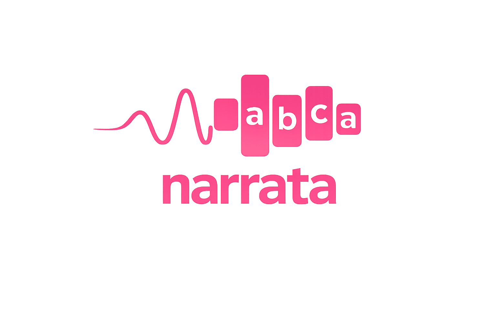

<p align="center">
  
</p>

<p align="center">
  <a href="https://github.com/marcinmiklitz/narrata/actions/workflows/tests.yml">
    
  </a>
  <a href="https://pypi.org/project/narrata/">
    
  </a>
  <a href="https://pypi.org/project/narrata-mcp/">
    
  </a>
  
  <a href="https://github.com/marcinmiklitz/narrata/blob/main/LICENSE">
    
  </a>
  <a href="https://marcinmiklitz.github.io/narrata/">
    
  </a>
</p>

<p align="center">
<code>narrata</code> turns price series into short text that an LLM can reason about quickly.
<br><br>
It is designed for situations where a chart is easy for a human to read,<br>but you need an agent to consume the same information as text.
</p>

<p align="center">
  
</p>

## Installation

From PyPI:

```bash
pip install narrata
```

With optional extras for enhanced backends:

```bash
pip install "narrata[all]"
```

## Quickstart

`narrate(...)` takes a pandas OHLCV DataFrame with a datetime index.

```python
import yfinance as yf
from narrata import narrate

df = yf.download("AAPL", period="1y", multi_level_index=False)
print(narrate(df, ticker="AAPL"))
```

Any data source works — yfinance, OpenBB, CSV, database — as long as you have a DataFrame with at least a `Close` column and a `DatetimeIndex`.
Column names are case-insensitive (`close` works as well as `Close`), `Adj Close` is automatically preferred over raw `Close` when both exist, and `Volume` is optional.
For shorter histories or missing columns, narrata keeps running and silently omits sections it cannot compute — no wasted tokens on placeholder text.

**Close-only mode:** If your data has only Close (or Close + Volume) without Open/High/Low, narrata works — summary, regime, indicators, symbolic encoding, and support/resistance all run normally. Patterns and candlestick sections are omitted automatically.

Example output:

```text
AAPL (251 pts, daily): ▅▄▃▁▂▁▁▂▂▂▄▄▆▇▇██▆▆▆
Date range: 2025-02-14 to 2026-02-13
Range: [171.67, 285.92]  Mean: 235.06  Std: 28.36
Start: 243.54  End: 255.78  Change: +5.03%
Regime: Uptrend since 2025-05-07 (low volatility)
RSI(14): 39.6 (neutral-bearish)  MACD: bearish crossover 0 days ago
BB: lower half
SMA 50/200: golden cross
Volume: 0.94x 20-day avg (average)
Volatility: 84th percentile (high)
SAX(16): ecabbabbdegghhhg
Candlestick: Inside Bar on 2026-02-10
Support: 201.77 (26 touches), 208.38 (23 touches)  Resistance: 270.88 (24 touches), 257.57 (22 touches)
```

## Token compression

The whole point of narrata is fitting price context into an LLM prompt without wasting tokens.
On a 251-day AAPL OHLCV DataFrame:

| Representation | Tokens (gpt-4o) |
|---|---|
| `df.to_string()` | ~9,000 |
| `df.to_csv()` | ~10,700 |
| `narrate(df)` | **~260** |

That's **~35–41x compression** while preserving regime, indicators, patterns, and support/resistance.

Reproduce this comparison:

```python
import tiktoken
import pandas as pd
from narrata import narrate

enc = tiktoken.encoding_for_model("gpt-4o")
# df = your OHLCV DataFrame
print(f"Raw:     {len(enc.encode(df.to_string())):,} tokens")
print(f"CSV:     {len(enc.encode(df.to_csv())):,} tokens")
print(f"narrate: {len(enc.encode(narrate(df))):,} tokens")
```

## Fallback vs extras (same input)

<!-- BACKEND_COMPARISON:START -->
Using the same static real-market MSFT dataset (251 daily points, yfinance fixture):

Use separate clean virtual environments when comparing fallback vs extras.

Fallback-only (`pip install narrata`):

```text
MSFT (251 pts, daily): ▂▁▁▁▃▄▅▇▇█▇███▇▆▅▆▆▂
Date range: 2025-02-14 to 2026-02-13
Range: [354.56, 542.07]  Mean: 466.98  Std: 49.62
Start: 408.43  End: 401.32  Change: -1.74%
Regime: Downtrend since 2026-01-29 (high volatility)
RSI(14): 32.4 (neutral-bearish)  MACD: bearish crossover 11 days ago
BB: lower half
SMA 50/200: death cross 17 days ago
Volume: 0.74x 20-day avg (below average)
Volatility: 94th percentile (extremely high)
SAX(16): aaabdfggggggffdb
Candlestick: Inside Bar on 2026-02-13
Support: 393.67 (15 touches), 378.77 (8 touches)  Resistance: 510.83 (34 touches), 481.63 (21 touches)
```

With extras (`pip install "narrata[all]"`):

```text
MSFT (251 pts, daily): ▂▁▁▁▃▄▅▇▇█▇███▇▆▅▆▆▂
Date range: 2025-02-14 to 2026-02-13
Range: [354.56, 542.07]  Mean: 466.98  Std: 49.62
Start: 408.43  End: 401.32  Change: -1.74%
Regime: Ranging since 2025-02-18 (low volatility)
RSI(14): 32.4 (neutral-bearish)  MACD: bearish crossover 11 days ago
BB: lower half
SMA 50/200: death cross 17 days ago
Volume: 0.74x 20-day avg (below average)
Volatility: 94th percentile (extremely high)
SAX(16): aaabdefggggggfed
Candlestick: Inside Bar on 2026-02-13
Support: 393.67 (15 touches), 378.77 (8 touches)  Resistance: 510.83 (34 touches), 481.63 (21 touches)
```

Main differences in this run:
- `Regime` changed: `Regime: Downtrend since 2026-01-29 (high volatility)` -> `Regime: Ranging since 2025-02-18 (low volatility)`
- `SAX(16)` changed: `SAX(16): aaabdfggggggffdb` -> `SAX(16): aaabdefggggggfed`
<!-- BACKEND_COMPARISON:END -->

## Crypto data adapters

Built-in adapters for common crypto data sources:

```python
from narrata import from_ccxt, from_coingecko, narrate

# ccxt (Binance, Coinbase, Kraken, etc.)
import ccxt
exchange = ccxt.binance()
ohlcv = exchange.fetch_ohlcv("BTC/USDT", "15m", limit=200)
df = from_ccxt(ohlcv, ticker="BTC/USDT")
print(narrate(df, currency_symbol="$", precision=0))

# CoinGecko (close + volume only, no OHLC)
data = cg.get_coin_market_chart_by_id(id="bitcoin", vs_currency="usd", days=90)
df = from_coingecko(data, ticker="BTC")
print(narrate(df, currency_symbol="$", precision=0))

# yfinance works directly — no adapter needed
import yfinance as yf
df = yf.download("BTC-USD", period="1y", multi_level_index=False)
print(narrate(df, ticker="BTC", precision=0))
```

CoinGecko data has no Open/High/Low, so patterns and candlestick sections are silently omitted. All other sections work normally.

## Compose your own output

Use lower-level functions when you want full control:

```python
from narrata import analyze_summary, describe_summary, make_sparkline

summary = analyze_summary(df)
text_block = describe_summary(summary)
spark = make_sparkline(df["Close"].tolist(), width=12)

print(text_block)
print(f"Close sparkline: {spark}")
```

## Compare two periods

`compare(...)` produces a compact diff narrative showing how a series changed between two time windows:

```python
from narrata import compare

df_q1 = df["2025-01":"2025-03"]
df_q2 = df["2025-04":"2025-06"]
print(compare(df_q1, df_q2, ticker="AAPL"))
```

Example output:

```text
AAPL: 2025-01-02..2025-03-31 → 2025-04-01..2025-06-30
Price: 243.54 → 215.30 (-11.6%)
Range: [220.10, 260.40] → [195.40, 230.10]
Regime: Uptrend (low vol) → Downtrend (high vol)
RSI(14): 58.2 (neutral) → 32.4 (neutral-bearish)
MACD: bullish → bearish crossover
Volume: 1.02x avg (average) → 0.85x avg (below average)
Volatility: 42nd pctl (moderate) → 85th pctl (high)
SAX(16): ddccbbaa → aabbccdd
Support: 225.40, 220.10 → 195.40, 200.10
Resistance: 255.80, 260.40 → 225.80, 230.10
```

## Output formats

Four output formats are available: `plain`, `markdown_kv`, `toon`, and `json`.

```python
from narrata import narrate

plain_text = narrate(df, output_format="plain")
markdown_text = narrate(df, output_format="markdown_kv")
json_text = narrate(df, output_format="json")
```

## Digit Splitting for LLM Robustness

`digit_tokenize(...)` is useful when your downstream model struggles with long or dense numeric strings.

Why this can help:

- Some tokenizers split long numbers in inconsistent chunks.
- Smaller models can be less stable when many decimals/signs appear close together.
- Splitting digits can reduce numeric parsing ambiguity in prompts and tool outputs.

When to use it:

- Use it for numeric-heavy prompts (prices, percentages, IDs, many decimals).
- Keep it off when human readability matters more than model robustness.

Example:

```python
from narrata import digit_tokenize

print(digit_tokenize("Price 171.24, move +3.2%"))
# <digits-split>
# Price 1 7 1 . 2 4 , move + 3 . 2 %
```

## Dependencies

Optional extras:

- `indicators`: `pandas-ta-openbb` (import path remains `pandas_ta`)
- `patterns`: `pandas-ta-openbb` (candlestick pattern backend)
- `regimes`: `ruptures` (for change-point regime detection)
- `symbolic`: `tslearn`, `ruptures` (`ruptures` currently supports Python < 3.14)
- `all`: install all compatible extras for your interpreter

## CLI

narrata includes a command-line tool that reads OHLCV data from CSV, TSV, or Parquet files (or stdin):

```bash
# Install with all extras
pip install "narrata[all]"

# Narrate a local CSV (format auto-detected from extension)
narrata prices.csv --ticker AAPL

# TSV and Parquet work the same way
narrata prices.tsv --ticker AAPL
narrata prices.parquet --ticker AAPL

# Pipe from stdin (defaults to CSV; use --input-format for others)
curl -s https://example.com/data.csv | narrata --ticker MSFT
cat prices.tsv | narrata --input-format tsv --ticker MSFT

# Output as JSON for programmatic consumption
narrata prices.csv --ticker AAPL --format json

# Control price precision (default: 2; use 0 for BTC, 4 for forex)
narrata prices.csv --ticker BTC --precision 0

# Use ASTRIDE instead of SAX for symbolic encoding
narrata prices.csv --ticker AAPL --symbolic-method astride

# Disable specific sections
narrata prices.csv --ticker AAPL --no-patterns --no-support-resistance

# Intraday data (frequency auto-detected, or set explicitly for patchy data)
narrata intraday_15m.csv --ticker AAPL --currency '$'
narrata intraday_15m.csv --ticker AAPL --frequency 15min

# Compare two periods side-by-side
narrata compare q1.csv q2.csv --ticker AAPL
```

The input must have a datetime column as its index and OHLC columns (Volume is optional). Column names are case-insensitive. Run `narrata --help` for all options.

## Agent Integrations

### narrata Skill

A reusable skill is included at `skills/narrata/SKILL.md`.

Depending on your CLI:

- Anthropic-style skills dir: copy to `~/.agents/skills/narrata/`
- Codex-style skills dir: copy to `~/.codex/skills/narrata/`

```bash
mkdir -p ~/.agents/skills/narrata
cp skills/narrata/SKILL.md ~/.agents/skills/narrata/SKILL.md
```

### FastMCP Server

A dedicated MCP package is available on [PyPI](https://pypi.org/project/narrata-mcp/).
Full docs: [`src/narrata-mcp/README.md`](https://github.com/marcinmiklitz/narrata/blob/main/src/narrata-mcp/README.md).

```bash
pip install narrata-mcp
narrata-mcp
```

<details>
<summary>Claude Desktop configuration</summary>

Add to your `claude_desktop_config.json`:

```json
{
  "mcpServers": {
    "narrata": {
      "command": "uvx",
      "args": ["narrata-mcp"]
    }
  }
}
```

</details>

## Intraday awareness

narrata auto-detects sub-daily frequencies (`1min`, `5min`, `15min`, `30min`, `hourly`) and scales indicator defaults so that lookback windows cover the same calendar-time horizons as daily mode. For patchy or unevenly-spaced data where auto-detection may fail, pass the frequency explicitly via `frequency="15min"` in the Python API, `--frequency 15min` on the CLI, or the `frequency` field in MCP tools. Use `frequency="irregular"` for fully unstructured data with no fixed interval — this keeps daily-scale indicator defaults but labels units as "bars" instead of "days".

| Parameter | Daily | 15min | 5min |
|---|---|---|---|
| SMA crossover | 50 / 200 | 10 / 40 | 30 / 120 |
| Volume lookback | 20 days | 26 bars (~1 day) | 78 bars (~1 day) |
| Volatility lookback | 252 bars (~1 year) | 520 bars (~20 days) | 1560 bars (~20 days) |

RSI(14), MACD(12/26/9), and Bollinger(20) keep their standard defaults — practitioners use these across timeframes.

Output labels adapt automatically:

```text
AAPL (130 pts, 15min): ▂▅▄▄▃▃▂▁▆▃▃▃▇▆▇█▇▇█▆
Date range: 2025-11-06 to 2025-11-12
Range: [$268.73, $275.55]  Mean: $271.67  Std: $2.34
Start: $268.73  End: $273.47  Change: +1.76%
Regime: Ranging since 2025-11-06 (low volatility)
RSI(14): 42.5 (neutral-bearish)  MACD: bearish crossover 6 days ago
BB: below lower band (squeeze)
SMA 10/40: golden cross 60 bars ago
Volume: 2.89x 26-bar avg (unusually high)
Volatility: 2nd percentile (extremely low)
SAX(16): dddcbacbbcfghghh
Patterns: Ascending triangle forming since 2025-11-10
Candlestick: Doji on 2025-11-12
Support: $272.02 (89 touches), $268.40 (52 touches)  Resistance: $274.96 (56 touches)
```

## Features

- Input validation for OHLCV DataFrames
- Summary analysis with date range context
- Regime classification (`Uptrend` / `Downtrend` / `Ranging`)
- **Intraday-aware indicators** — auto-scaled SMA, volume, and volatility defaults for sub-daily bars
- RSI and MACD interpretation (uses `pandas_ta` indicator lines when available)
- Volume analysis (ratio to moving average)
- Bollinger Band position and squeeze detection
- Moving average crossover detection (golden/death cross)
- Volatility percentile ranking
- SAX symbolic encoding
- ASTRIDE adaptive symbolic encoding (requires `ruptures`)
- Pattern detection plus candlestick detection (`pandas_ta` first, in-house fallback)
- Support/resistance extraction
- Compact Unicode sparklines
- Output formatting helpers (`plain`, `markdown_kv`, `toon`)
- High-level `narrate(...)` composition
- Period comparison via `compare(...)`

## FAQ

### Is narrata redundant if I already use OpenBB, yfinance, or another data SDK?

No. `narrata` is complementary.

It sits on top of your existing data layer and turns OHLCV data into compact, LLM-ready narrative text.

Typical flow:

```text
Data source (OpenBB / yfinance / CSV / DB)
        -> pandas DataFrame (OHLCV)
        -> narrata
        -> concise narrative context for an LLM
```

`narrata` is data-source-agnostic: if you can produce a standard OHLCV DataFrame, you can use it.

### Does narrata call an LLM or provide LLM endpoints?

No. This is intentional.

`narrata` is a pure Python library with deterministic, programmatic analysis and narration. It does not make LLM API calls and does not ship model endpoints.

Use it as a pipeline component:

```text
your data -> narrata text output -> your chosen LLM/runtime
```

This keeps the library lightweight, testable, and provider-agnostic.

## Citation

If you use `narrata` in research, publications, or public projects:

```bibtex
@software{miklitz_narrata,
  author  = {Miklitz, Marcin},
  title   = {narrata},
  url     = {https://github.com/marcinmiklitz/narrata},
  license = {MIT}
}
```

You can also use the GitHub "Cite this repository" button or the metadata in `CITATION.cff`.
